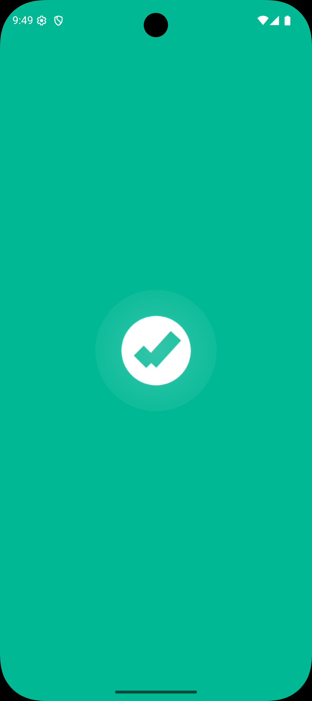
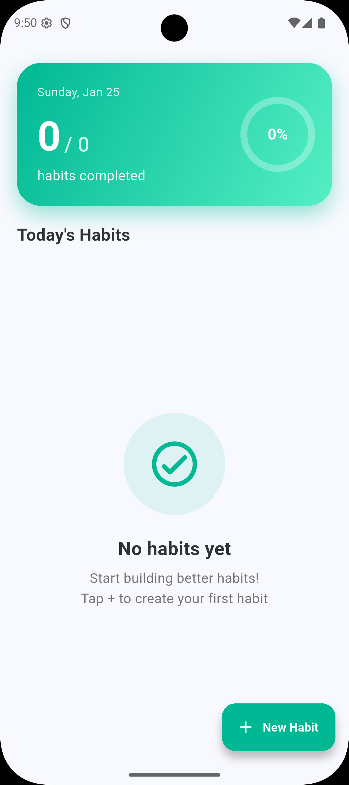
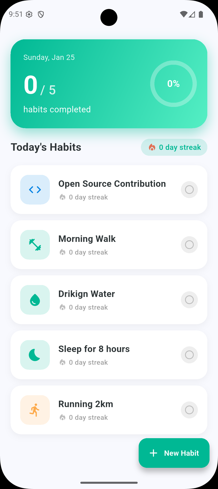
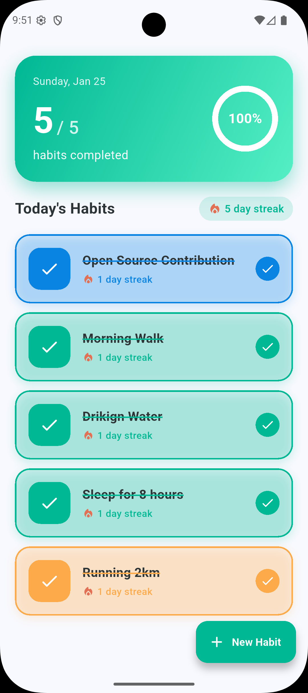
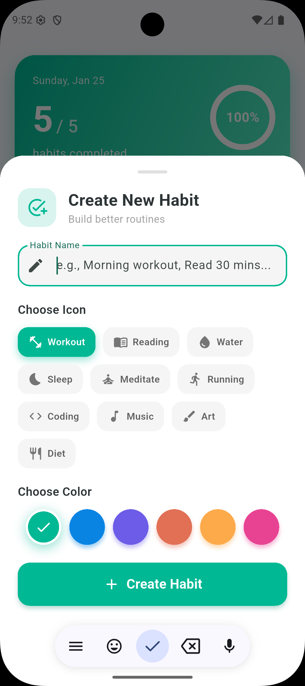

<p align="center">
  
</p>

<h1 align="center">Habit Tracker</h1>

<p align="center">
  A beautiful habit tracking app built with Flutter
</p>

<p align="center">
  
  
  
</p>

---

## Features

- Create and track daily habits
- Streak counter to maintain motivation
- Circular progress indicator
- Mark habits as complete with a tap
- Swipe to delete habits
- Local storage - your habits stay private
- Beautiful Material Design 3 UI

## Screenshots

<p align="center">
  
  
  
  
  
</p>

## Tech Stack

- Flutter 3.10+
- Dart
- Material Design 3

## Installation

```bash
cd habit_tracker
flutter pub get
flutter run
```

## Build APK

```bash
flutter build apk --release
```

## Privacy

Habit Tracker stores all data locally on your device. No data is collected or transmitted.

## License

This project is licensed under the MIT License - see the [LICENSE](LICENSE) file for details.

---

<p align="center">
  Made with Flutter
</p>
